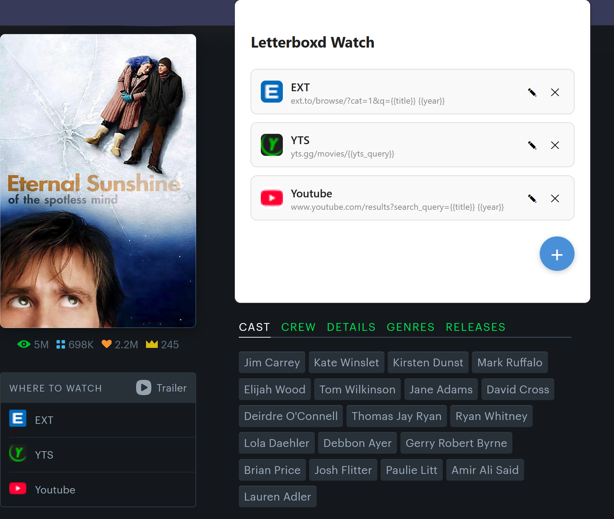

# Letterboxd Watch

## Installation

### Firefox

### Chrome/Edge
1. Download this repository
2. Open Chrome/Edge and go to **chrome://extensions**
3. Toggle on **Developer mode** checkbox
4. Click the **Load unpacked extension** button and select the repository folder

## Contributing

Pull requests and issues are welcomed.